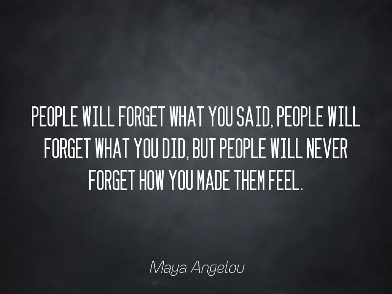

# Daily motivational quote printed on picture

## Languages, tools and API

[Node JS](https://nodejs.org/en/)
[Jimp](https://github.com/oliver-moran/jimp)
[Zenquotes API](https://zenquotes.io/)

## Description

By running this code, it will create a picture with a daily motivational and inspirational quote fetched from Zen Quotes API printed on top of the picture.
The generation is fully dynamic, and you can change parameters according to your preference in the config.json file.

For every modification on the image (resize, blur, print text), I used Jimp.

The assets folder store the fonts and background image you wish to use.

The intermediar and final images are written in the output folder.

## Variables (config.json)

````json5
{
    "image": {
        "path": "assets/images/bg.jpg", // Path of the background image
        "height": 800, // Height of the background image
        "width": 600, // Width of the background image
        "margin": 40 // Horizontal margins to apply on the quote text
    },
    "fonts": {
        "quote": "assets/fonts/font_text_48.fnt", // Path of the font to be used for the quote
        "author": "assets/fonts/font_author_32.fnt" // Path of the font to be used for the author
    }
}
````

## Exemple of generated image


